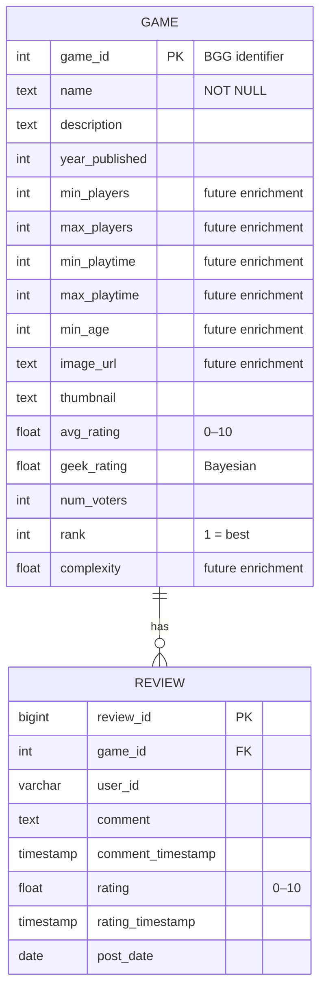

# ER Diagram

The application's data model has two business entities (`Game` and `Review`)
and a 1-to-many relationship between them: one game has zero or more reviews;
each review belongs to exactly one game.



## Cardinalities

- **GAME** : **REVIEW** = `1` : `0..N` (a game may have any number of reviews,
  including zero; a review must reference an existing game — enforced by
  the `REFERENCES Game(game_id) ON DELETE CASCADE` constraint).

## Identification

- `game_id` is BGG's stable integer ID. We adopted it as the primary key
  rather than minting a synthetic surrogate, because it remains the unique
  identifier across both source CSVs and external links.
- `review_id` is BGG's review ID, also stable.
- `(game_id, user_id)` is **not** unique — the source data contains
  multiple reviews from the same user across time.

## Why no extra "user" entity

We considered promoting `user_id` (`Review.user_pseudouserid`) to its own
`User` entity, but chose not to because:

1. The source dataset gives us nothing else about a user — no display name,
   country, total reviews, etc. A `User` table would have a single column
   (`user_id`), making it a redundant abstraction.
2. With user-related data limited to a single attribute, a separate table
   has no functional dependency that violates 2NF or 3NF in `Review` — see
   `docs/normalization.md` for the proof.

## Why no category / mechanic / designer / publisher entities

These would be valuable extensions if we had the corresponding source data —
the BGG XML API exposes them — but the Kaggle dump used for M3/M4 does not.
Adding empty stub tables would not pass a 3NF justification in the report
because they would have no functional dependency to satisfy.

## Source rendering

The diagram above is written in
[Mermaid](https://mermaid.js.org/syntax/entityRelationshipDiagram.html). It
renders directly on GitHub. To export a PNG for the slide deck:

```bash
npx -y @mermaid-js/mermaid-cli -i docs/er_diagram.md -o docs/er_diagram.png
```
